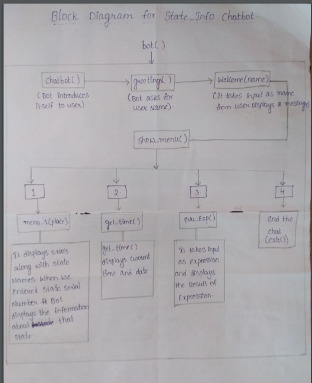

#STATE_INFO_CHAT_BOT

Team Mates:

Dasari Surya Ratnakara Naidu (Register No: 19PA5A0307)

Dasari Anusha(Register No:18PA1A0539)

D.Vaishnavi (Register No:19pa1a0538)

The objective of State_info Chatbot:

It displays the state Information and also it performs datetime.now() and calculations of an expression.

Block Diagram: 

youtube link : https://www.youtube.com/watch?v=kdavHFz8KF0

Description: The first step of State_Info bot is calling chatbot function that introduces itself, next bot call greetings() it asks for the name then, welcome() takes a name as input and display some message along with the name. Secondly, Show_menu() performs 4 types actions. if the user enters 1 -> It displays the serial numbers with state names, Then the user has to select one number and enter, it will give the information about that state. If the user enters 2 -> It displays the current date with time. If the user enters 3 -> It takes input as an expression and produces the result of an expression. If the user enters 4 -> It will end the chat

Source Links ;
1.https://en.m.wikipedia.org/wiki/List_of_current_Indian_chief_ministers
2.https://www.india.gov.in/my-government/whos-who/governors
3.https://www.careerpower.in/states-and-capitals-of-india.html
